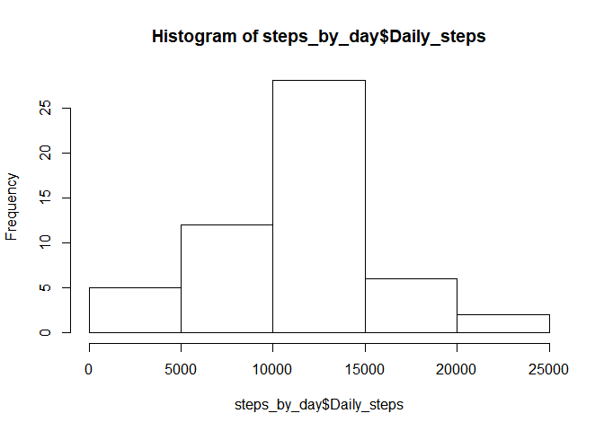
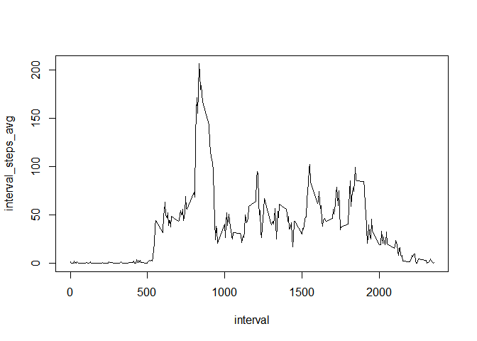
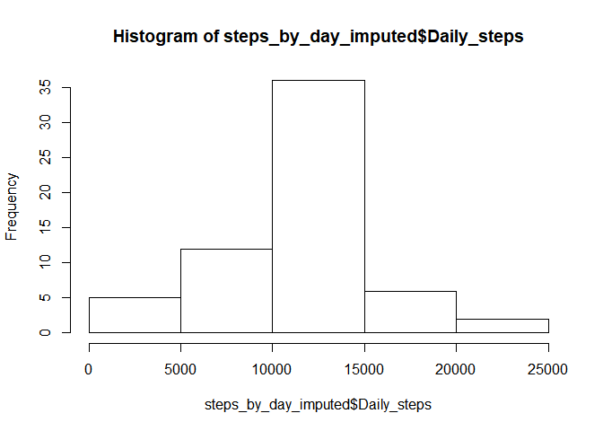
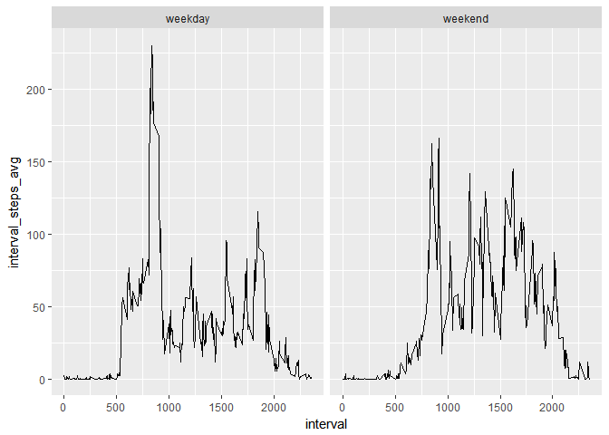

set working directory and load data
-----------------------------------

    setwd("C:/Users/srivers/Desktop/R_Workspace/Reproduce_Research/RepData_PeerAssessment1")
    data<-read.csv("activity/activity.csv")

turn in to Data Table
---------------------

    library(data.table)
    data<-data.table::data.table(data)

Create Data set which excludes NAs
----------------------------------

    data_no_nas<-data[complete.cases(data),]

Aggregate steps by day
----------------------

    steps_by_day<-data_no_nas[,list(Daily_steps=sum(steps)),by="date"]

Create Histogram of Steps by day
--------------------------------

    hist(steps_by_day$Daily_steps)

Find Mean and Median
====================

    Daily_steps_mean<-mean(steps_by_day$Daily_steps)
    Daily_steps_median<-median(steps_by_day$Daily_steps)

    Daily_steps_mean

    ## [1] 10766.19

    Daily_steps_median

    ## [1] 10765

Aggregate Steps by 5 minute interval
------------------------------------

    steps_by_interval5<-data_no_nas[,list(interval_steps_avg=mean(steps)),by="interval"]

Time Series Plot
----------------

    with(steps_by_interval5,plot(interval,interval_steps_avg,type = "l"))

Find Interval with maximum number of steps
------------------------------------------

    max_steps<-max(steps_by_interval5$interval_steps_avg)
    interval_w_max_steps<-steps_by_interval5[interval_steps_avg==max_steps,interval]
    interval_w_max_steps

    ## [1] 835

Calculate total number of Missing Values
----------------------------------------

    missing_values_data<-data[!complete.cases(data)]
    missing_values_count<-nrow(missing_values_data)
    missing_values_count

    ## [1] 2304

Impute Missing Values with the average with the overall interval average
------------------------------------------------------------------------

    data_imputed<-merge( data, steps_by_interval5[,.(interval,interval_steps_avg)] ,all.x = TRUE)
    data_imputed$steps<-ifelse(is.na(data_imputed$steps),data_imputed$interval_steps_avg,data_imputed$steps)

Aggregate steps by day with imputed data
----------------------------------------

    steps_by_day_imputed<-data_imputed[,list(Daily_steps=sum(steps)),by="date"]

Create Histogram of Steps by day of imputed data
------------------------------------------------

    hist(steps_by_day_imputed$Daily_steps)

Find Mean and average of imputed data
-------------------------------------

    Daily_steps_mean_imputed<-mean(steps_by_day_imputed$Daily_steps)
    Daily_steps_median_imputed<-median(steps_by_day_imputed$Daily_steps)

    Daily_steps_mean_imputed>Daily_steps_mean

    ## [1] FALSE

    Daily_steps_mean_imputed==Daily_steps_mean

    ## [1] TRUE

    Daily_steps_median_imputed>Daily_steps_median

    ## [1] TRUE

There is no difference between the average steps by data between the
original data and the imputed data However the median of the imputed
data is slightly larger

Create Weekday Weekend Factor
-----------------------------

    data_imputed$day_of_week<-weekdays(as.Date(data_imputed$date),TRUE)
    data_imputed$day_type<-factor(ifelse(data_imputed$day_of_week %in% c('Sat','Sun'),'weekend','weekday'))

Aggregate data by interval/day\_type for panel plot
---------------------------------------------------

    steps_by_interval5_imputed<-data_imputed[,list(interval_steps_avg=mean(steps)),by=c("interval","day_type")]

Create Panel Plot of average number of steps by interval for weekdays and weekends
----------------------------------------------------------------------------------

    library(ggplot2)
    ggplot(steps_by_interval5_imputed,aes(interval,interval_steps_avg))+facet_wrap(~day_type)+geom_line()

